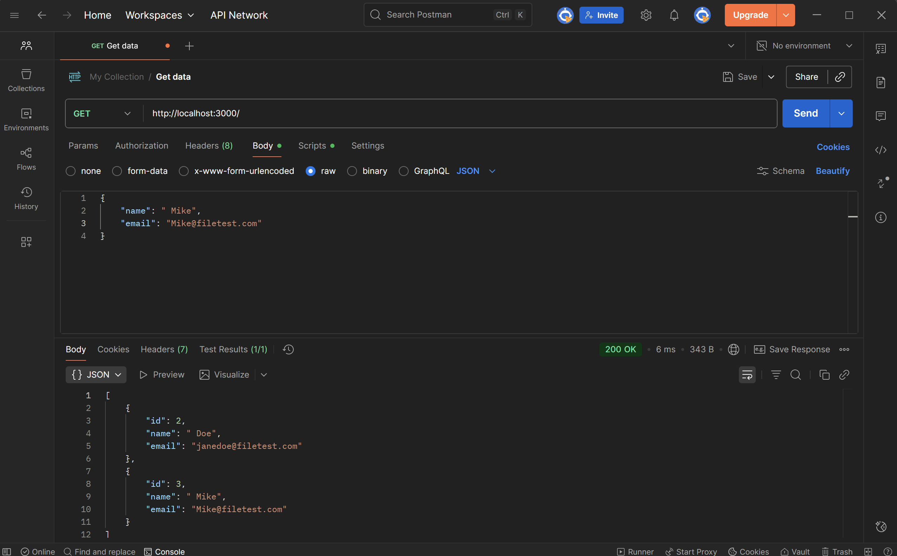
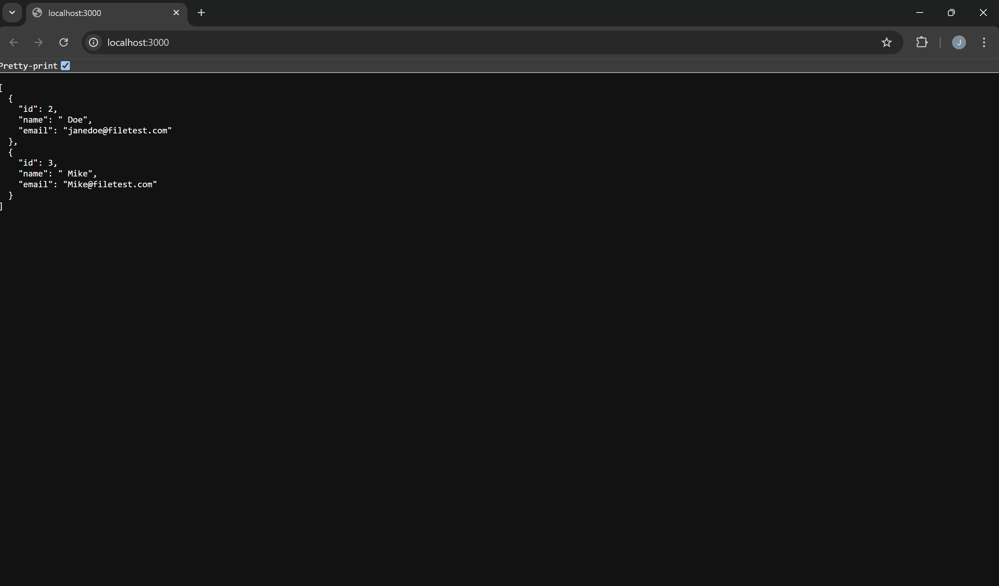

# 👤 User CRUD API 

A simple RESTful API for managing user records (CRUD operations), built using **Node.js** and **Express.js**.

**Key Feature:** Data is stored persistently in a local **JSON file (`data/users.json`)**. The user data is accessible directly from the base URL (`/`), and the API starts with no predefined users.

## ⚙️ 1. Setup & Installation

Follow these steps in your terminal to get the project running.

1.  **Navigate to the project directory:**
    ```bash
    cd user-crud-api
    ```

2.  **Install dependencies:**
    ```bash
    npm install
    ```

3.  **Start the server:**
    ```bash
    npm start
    ```
    The API will be available at **`http://localhost:3000`**.

## 🚀 2. Verification

The data is visible and functional in both API tools (Postman) and web browsers.

| Description | Screenshot |
| :--- | :--- |
| **Testing in Postman ** |  |
| **Viewing in Browser ** |  |

## 🛠️ 3. API Endpoints Overview

All operations are accessed directly from the base URL or with an ID parameter, as the user router is mounted at the root (`/`).

| Method | Endpoint | Description | Success Code |
| :--- | :--- | :--- | :--- |
| **GET** | `/` | **READ:** Retrieve a list of all current users (returns JSON). | `200 OK` |
| **POST** | `/` | **CREATE:** Add a new user record. | `201 Created` |
| **PUT** | `/:id` | **UPDATE:** Modify an existing user's details by their ID. | `200 OK` |
| **DELETE** | `/:id` | **DELETE:** Remove a user record by their ID. | `204 No Content` |

## 🧪 4. Testing the Endpoints (Postman Examples)

### A. Create a User (POST)

* **Method:** `POST`
* **URL:** `http://localhost:3000/`
* **Body (raw JSON):**
    ```json
    {
        "name": "Alex Johnson",
        "email": "alex@example.com"
    }
    ```

### B. Read All Users (GET)

* **Method:** `GET`
* **URL:** `http://localhost:3000/`

### C. Update a User (PUT)

* **Method:** `PUT`
* **URL:** `http://localhost:3000/1`
* **Body (raw JSON):**
    ```json
    {
        "name": "Alexander J.",
        "email": "alex.j@example.com"
    }
    ```

### D. Delete a User (DELETE)

* **Method:** `DELETE`
* **URL:** `http://localhost:3000/1`

## 🛑 5. Validation & Error Responses

| Status Code | Message | Description |
| :--- | :--- | :--- |
| **400 Bad Request** | `Validation failed` | Missing required fields or invalid format. |
| **404 Not Found** | `User with ID X not found` | Attempted to modify or delete a non-existent ID. |
| **409 Conflict** | `Email already exists.` | Attempted to create a user with a duplicate email address. |